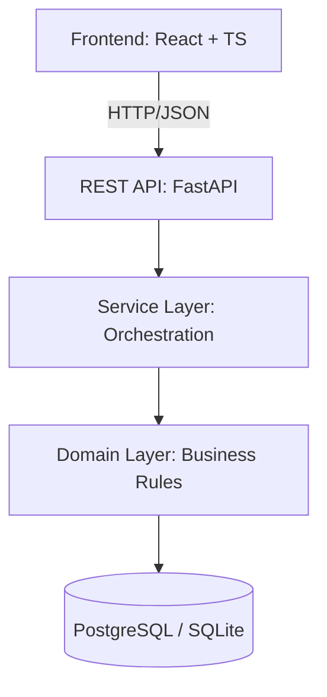

# Loja App — Payment System Laboratory

[](https://github.com/Argenis1412/Loja_app/actions/workflows/backend-ci.yml)
[](https://github.com/Argenis1412/Loja_app/actions/workflows/frontend-ci.yml)
[](https://www.python.org/downloads/)
[](https://www.typescriptlang.org/)
[](LICENSE.txt)

**Loja App** is a learning laboratory focused on backend-first architecture and payment logic. It demonstrates how to build a robust payment system with explicit business rules, layered architecture, and a focused frontend.

---

## 🚀 Quick Start (Windows)

The easiest way to get started is using the included PowerShell scripts:

1.  **Setup**: `.\setup.ps1` (Creates venv, installs dependencies)
2.  **Run Backend**: `.\run_backend.ps1` (FastAPI at `localhost:8000`)
3.  **Run Frontend**: `.\run_frontend.ps1` (React at `localhost:5173`)
4.  **Tests**: `.\run_tests.ps1` (Runs all backend & frontend tests)

*For manual setup or Linux/macOS instructions, see the [Backend](backend/README.md) and [Frontend](frontend/README.md) documentation.*

---

## 🏗 Architecture

The project follows a **Clean Architecture** approach, ensuring business logic is isolated from external frameworks.



### Core Responsibilities
- **Backend as Source of Truth**: All calculations (discounts, interest, installment splitting) happen in the backend domain layer.
- **Explicit Domain Logic**: Payment rules are isolated in `domain/calculadora.py` and are 100% unit-tested.
- **Frontend as API Consumer**: The UI collects input and renders results without performing calculations.

---

## 📊 Business Rules

The system supports four primary payment methods with configurable rules:

| Option | Mode | Installments | Rule |
|:---:|---|---|---|
| **1** | Cash | 1x | 10% Discount |
| **2** | Debit | 1x | 5% Discount |
| **3** | Credit | 2-6x | No Interest |
| **4** | Credit | 12-24x | 10% Interest |

**Exact Total Splitting**: When payments are split, the system automatically adjusts the last installment to ensure the total is mathematically exact (preventing rounding errors).

---

## 📁 Project Structure

```text
Loja_app/
├── backend/    # FastAPI + Clean Architecture
├── frontend/   # React + TypeScript + Tailwind
├── docs/       # Visual documentation & images
├── Makefile    # Build automation
└── DEPLOYMENT.md # Production guides (Render/Vercel)
```

---

## 📖 Documentation

- **[Backend Guide](backend/README.md)**: API Specs, Domain Analysis, and Persistence.
- **[Frontend Guide](frontend/README.md)**: UI Components, State Management, and Integration.
- **[Deployment Guide](DEPLOYMENT.md)**: Step-by-step instructions for Cloud hosting.

---

## 👥 Author & License

Developed by **Argenis Mauricio López Salazar** ([LinkedIn](https://www.linkedin.com/in/argenis1412/) | [GitHub](https://github.com/Argenis1412)).

Licensed under the **MIT License**. See `LICENSE.txt` for details.